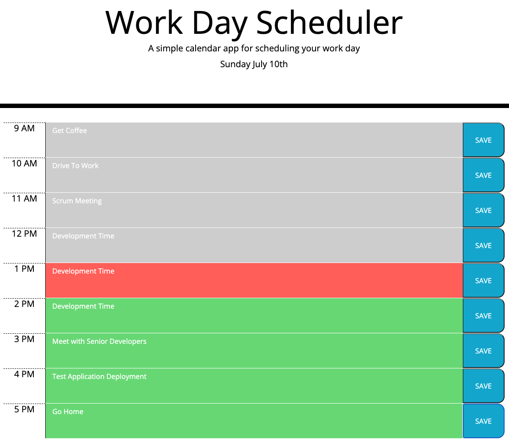

# Work Day Scheduler

## Purpose
Create a simple workday scheduling application that uses moment.js to work with date and time, dynamically color codes the day based on the passage of time, and uses localStorage to persist data.

## Screenshot

## Built With
* HTML
* CSS
* Javascript
* jQuery
* moment.js

## Website
https://matt-wiser.github.io/weekly-challenge-5/

## Contribution
Made by Matthew Wiser